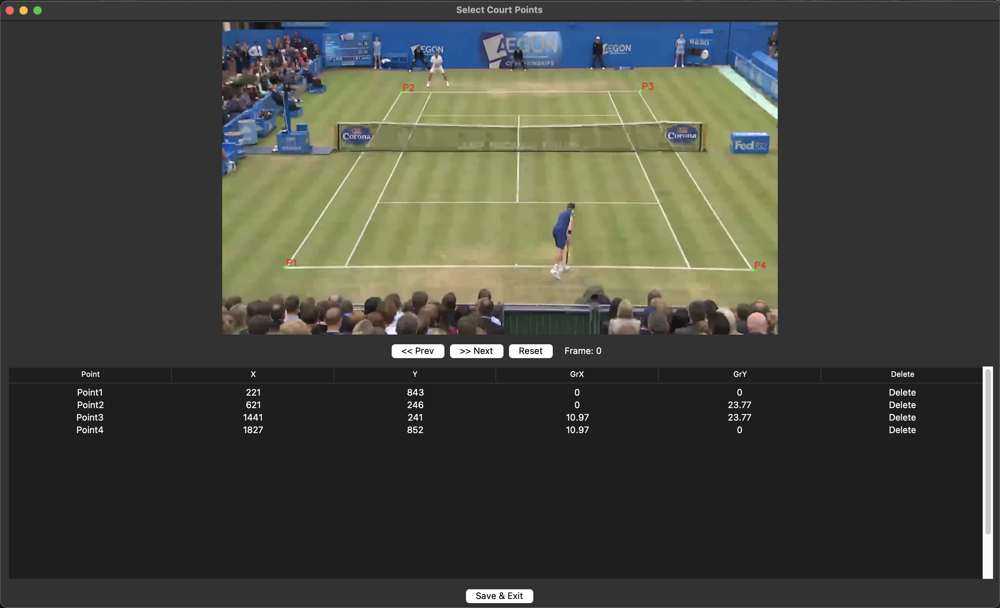

# Minimalist Annotation Scripts

## Setup
1. Create a virtual environment and install requirements: `pip install -r requirements.txt`

## Files

### video_tagger.py

1. Populate the labels.csv with the labels you would like to use for tagging. One row corresponds to one label.
2. Run the script:
    - `python3 video_tagger.py {path_to_video} {path_to_labels.csv} --output_csv {name_of_output.csv (optional)}`
    - Alternatively, define the variables `VIDEO_PATH`, `LABELS_CSV` and `OUPTUT_CSV` and run `python3 video_tagger.py`
3. The output csv, by default, will have the file name `{video_path}_tagged.csv` and will contain the following columns:
    - Frame Number
    - Label Name
    - Pixel X Coordinate
    - Pixel Y Coordinate

### court_tagger.py

1. Run the script:
    - `python3 court_tagger.py {number_of_points} {path_to_video} --output_csv {name_of_output.csv (optional)}`
    - Alternatively, define the variables `VIDEO_PATH`, `NUM_POINTS` and `OUPTUT_CSV` and run `python3 court_tagger.py`
2. The file will display the first frame of the video. To navigate between video frames, use the buttons or left and right arrows.
3. Click on the points in the video
4. Double click on the GrX and GrY columns and type the values you want to use for the ground truth columns. Press Enter to confirm the values.
5. Press "Save and Exit" to create an output `{video_name_}_calibrated.csv` that is generated by default and saved to the same location as the input video.

### apply_homography.py
1. Run the script: `python3 apply_homography.py {path_to_original_coords.csv} {path_to_court_points.csv}`
2. The script will:
    - Compute a homography matrix from the court-tagged CSV (X, Y → GrX, GrY)
    - Apply this transformation to all pairs of coordinate columns ending in _x and _y in the original CSV
    - Save the transformed metric coordinates into new columns named {stem}_x_meters, {stem}_y_meters
3. A new CSV will be saved with `_homography.csv` appended to the original filename. Example output columns:
    - `left_wrist_x`, `left_wrist_y` → transformed to `left_wrist_x_meters`, `left_wrist_y_meters`
    - `right_ankle_x`, `right_ankle_y` → transformed to `right_ankle_x_meters`, `right_ankle_y_meters`
